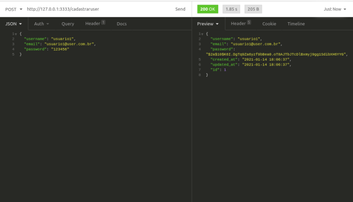

# Backend Adonis, cadastro de usuario e produtos e login

Api desenvolvida com adonis que contem um sistema de login através de middleware e com token, utilizando PostgreSQL como banco de dados.



## Setup

para instalar a api e exutar, use o seguinte comando:

```bash
adonis new yardstick --api-only
```

ou clone o repo e instale manualmente com o seguinte comando:`npm install`.


### Migrations

rode o comando abaixo para efetuar as migrations no Banco de Dados

```js
adonis migration:run
```

## uso

Uma api que recebe cadastro de usuarios para login, e atravé do token é possivel cadastrar, deletar e consultar uma tabela de produtos e valores, seu funcionamento pode ser visualizado em uma ferramenta  que faz requisiçoes rest, Insomnia, Postman.

Cauê Rafael Burgardt

--------------------------------------------------------------------------------------------------------------------------------------------------------------------

# Adonis backend, user and product registration and login

Api developed with adonis that contains a login system through middleware and with token, using PostgreSQL as a database.


## Setup

to install the api and exutar, use the following command:

`` bash
adonis new yardstick --api-only
``

or clone the repo and install manually with the following command: `npm install`.


### Migrations

run the command below to perform migrations in the database

`` js
adonis migration: run
``

## usage

An api that receives registration of users for login, and through the token it is possible to register, delete and consult a table of products and values, its operation can be visualized in a tool that makes requests rest, Insomnia, Postman.

Cauê Rafael Burgardt

